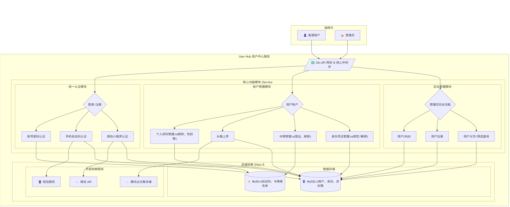

## User Hub

## 描述

User Hub 是一个用户中心服务，提供用户账户管理、认证、资料管理等功能。它支持多种登录方式，包括账号密码、手机验证码和微信小程序登录。该项目采用 Go 语言编写，使用了 Gin Web 框架，并集成了 MySQL 和 Redis 作为数据存储和缓存。

## 架构图 (Architecture Diagram)

项目的功能流转架构图如下所示。



## 功能特性

* **用户认证**：
    * 账号密码注册和登录
    * 手机号验证码发送、登录或注册
    * 微信小程序 `code` 登录或注册
* **令牌管理**：
    * 生成访问令牌 (Access Token) 和刷新令牌 (Refresh Token)
    * 通过刷新令牌获取新的令牌对
    * 用户退出登录 (吊销令牌)
    * JWT (JSON Web Tokens) 用于令牌的生成与解析
    * 令牌黑名单机制，防止已吊销令牌的重用
* **用户管理** (管理员权限)：
    * 创建新用户账户
    * 获取用户核心信息 (角色、状态等)
    * 更新用户核心信息
    * (软) 删除用户账户及其所有关联数据 (身份、资料)
    * 拉黑用户账户
* **用户资料管理**：
    * 创建用户个人资料 (昵称、头像、性别、地区等)
    * 获取用户个人资料
    * 更新用户个人资料
    * 删除用户个人资料
* **用户身份管理**：
    * 为用户创建新的身份标识 (例如，绑定邮箱、手机号等)
    * 更新用户身份凭证 (例如，修改密码)
    * 删除用户的某个身份标识 (例如，解绑微信)
    * 查询用户的所有身份信息及类型
* **用户列表查询** (管理员权限)：
    * 分页查询用户列表及其关联的 Profile 信息
    * 支持按条件过滤和排序
* **API 与其他**：
    * 使用 Gin Web 框架构建 RESTful API
    * Swagger API 文档集成 (`/swagger/index.html`)
    * 自定义输入验证器 (手机号、用户名、密码、枚举值等)
    * 密码哈希存储 (bcrypt)
    * 结构化日志 (Zap Logger)
    * 配置文件管理 (YAML)
    * 优雅的服务启动和关停处理
    * Docker Compose 支持本地开发环境 (MySQL, Redis)
    * 依赖注入模式组织代码结构
    * 可选的分布式追踪 (OpenTelemetry)
    * HTTP 中间件处理 (错误处理、请求日志、超时、用户上下文)

## 技术栈与依赖

* **语言**: Go
* **Web 框架**: Gin
* **数据库**: MySQL (使用 GORM 作为 ORM)
* **缓存**: Redis (使用 go-redis)
* **配置**: Viper (通过 `sharedCore.LoadConfig` 间接使用), YAML
* **日志**: Zap
* **JWT**: golang-jwt/jwt/v5
* **API 文档**: Swaggo/swag
* **验证器**: go-playground/validator/v10
* **密码哈希**: golang.org/x/crypto/bcrypt
* **UUID**: [github.com/google/uuid](https://github.com/google/uuid)
* **容器化**: Docker, Docker Compose
* **公共模块**: `github.com/Xushengqwer/go-common` (用于核心库、错误处理、枚举、响应格式、中间件等)
* **分布式追踪 (可选)**: OpenTelemetry

## 项目结构

```
user_hub/
├── config/                   # 配置文件及对应的 Go 结构体 (config.development.yaml, jwt.go, mysql.go, etc.)
├── constants/                # 应用常量 (redis.go, service.go, token.go)
├── controller/               # HTTP 请求处理器 (account.go, captcha.go, identity.go, etc.)
├── dependencies/             # 外部服务客户端及初始化 (jwt_token.go, mysql.go, redis.go, sms.go, wechat.go)
├── docs/                     # Swagger API 文档生成文件 (docs.go, swagger.json, swagger.yaml, swagger_types.go)
├── initialization/           # 应用依赖和服务初始化 (appService.go, dependencies.go)
├── main.go                   # 应用入口文件
├── middleware/               # 自定义 HTTP 中间件 (UserContext.go)
├── models/                   # 数据模型
│   ├── dto/                  # 数据传输对象 (account.go, identity.go, manage.go, etc.)
│   ├── entities/             # GORM 数据库实体 (user.go, userIdentity.go, userProfile.go)
│   ├── enums/                # 枚举类型 (gender.go, identityType.go)
│   └── vo/                   # 视图对象 (API响应) (auth.go, empty.go, identity.go, etc.)
├── repository/               # 数据持久层 (仓库模式)
│   ├── mysql/                # MySQL 仓库实现 (identityRepo.go, joinQuery.go, profileRepo.go, userRepo.go)
│   └── redis/                # Redis 仓库实现 (code.go, tokenBlack.go)
├── router/                   # API 路由定义 (global.go)
├── service/                  # 业务逻辑层
│   ├── identity/             # 用户身份服务 (identity.go)
│   ├── login/                # 登录相关服务
│   │   ├── auth/             # 账号密码、手机号认证 (account.go, phone.go)
│   │   └── oAuth/            # OAuth 认证 (wechat.go)
│   ├── profile/              # 用户资料服务 (profile.go)
│   ├── token/                # 令牌管理服务 (token.go)
│   ├── userList/             # 用户列表查询服务 (userList.go)
│   └── userManage/           # 用户核心管理服务 (userManage.go)
├── utils/                    # 工具函数 (custom_validators.go, password.go, verification_code.go)
└── docker-compose.yml        # Docker Compose 配置文件，用于本地开发环境
```

## 先决条件

* Go (版本请参照项目 `go.mod` 文件，虽未提供，但通常为较新版本)
* Docker 和 Docker Compose (用于本地依赖服务)
* MySQL 数据库
* Redis 服务

## 开始

### 1. 配置

项目通过 `config/config.development.yaml` 文件进行配置。您可以复制此文件并根据需要进行修改，例如创建 `config.production.yaml`。

关键配置项包括：

* **数据库连接** (`mySQLConfig`)
* **Redis 连接** (`redisConfig`)
* **JWT 密钥** (`jwtConfig`): `secret_key` 和 `refresh_secret` 务必在生产环境中使用强密钥，并考虑从环境变量或 K8s Secret 加载。
* **微信小程序配置** (`wechatConfig`): `appID`, `secret`
* **短信服务配置** (`smsConfig`): `appID`, `secret`, `endpoint`, `templateID`, `env`
* **服务器端口** (`serverConfig.port`)
* **日志级别** (`zapConfig.level`, `gormLogConfig.level`)
* **分布式追踪 (可选)** (`tracerConfig`)

### 2. 启动依赖服务 (使用 Docker Compose)

项目提供了一个 `docker-compose.yml` 文件，用于快速启动本地开发所需的 MySQL 和 Redis 服务。

```bash
docker-compose up -d
```

这将会在后台启动 MySQL（端口 3306）和 Redis（端口 6379）容器。
* MySQL 数据库名: `doer_userHub`
* MySQL root 密码: `root`
* Redis 密码: `root`

请确保您的 `config.development.yaml` 中的数据库和 Redis DSN/密码与 `docker-compose.yml` 中的设置一致。

### 3. 运行应用

```bash
go run main.go --config=config/config.development.yaml
```

或者，如果您构建了二进制文件：

```bash
go build -o user_hub_app
./user_hub_app --config=config/config.development.yaml
```

服务默认启动在 `localhost:8080` (或您在配置文件中指定的端口)。

## API 文档

项目集成了 Swagger UI 用于 API 文档和测试。服务启动后，可以通过以下 URL 访问：

`http://localhost:8080/swagger/index.html` (请将端口替换为您配置的端口)

API 的基础路径为 `/api/v1`。

## 使用示例

请参考 Swagger 文档以了解各个 API 端点的请求和响应格式。

**一些关键的 API 端点示例** (具体路径请参考 Swagger):

* **账号注册**: `POST /api/v1/account/register`
* **账号登录**: `POST /api/v1/account/login`
* **发送短信验证码**: `POST /api/v1/auth/send-captcha`
* **手机号登录/注册**: `POST /api/v1/phone/login`
* **微信小程序登录/注册**: `POST /api/v1/wechat/login`
* **刷新令牌**: `POST /api/v1/auth/refresh-token`
* **退出登录**: `POST /api/v1/auth/logout`
* **获取用户信息**: `GET /api/v1/users/{userID}`
* **更新用户资料**: `PUT /api/v1/profiles/{userID}`

客户端在调用需要认证的接口时，应在 HTTP 请求头的 `Authorization` 字段中携带 `Bearer <AccessToken>`。

## 注意事项

* **安全**: JWT 密钥、数据库密码等敏感信息在生产环境中绝不应硬编码在配置文件中。应使用环境变量、配置文件挂载 (如 K8s ConfigMaps/Secrets) 或专门的密钥管理服务。
* **错误处理**: 项目使用了自定义的错误响应格式和错误码，具体可参考 `github.com/Xushengqwer/go-common/response` 和 `github.com/Xushengqwer/go-common/commonerrors`。
* **日志**: 应用日志对于调试和监控至关重要。请根据环境配置合适的日志级别和输出格式 (如 JSON 用于生产环境)。
* **数据库迁移**: 应用启动时会自动执行数据库表结构迁移 (`AutoMigrate`)。 在生产环境中，数据库迁移应谨慎处理，可能需要专门的迁移工具和流程。